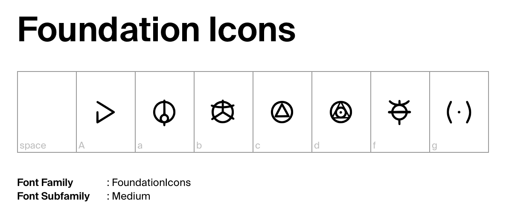

# Foundation Icons Hand
Icons used in the Apple TV+ series Foundation, encountered in signage and on screens.  Released with the SIL Open Font License (OFL).

Here's an example:

The source .ifm2archive files are in the file format used by iFontMaker, the iPad font-design tool made by Eiji and Tom, Inc., which you can find at <a href="https://2ttf.com/" title="Jump to 2ttf.com">2ttf.com</a>.

The icons created so far (version 0.1.07):

